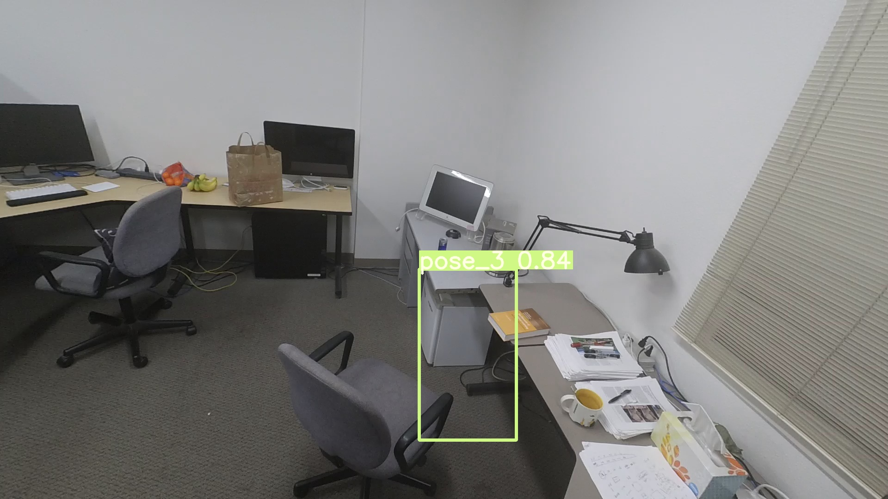

# Introduction

This repo is based on YOLO-V3(https://github.com/eriklindernoren/PyTorch-YOLOv3), which provided a easy way for us to achieve first person and third person video understanding.

# Requirements

Python 3.7 or later with the following `pip3 install -U -r requirements.txt` packages:

- `numpy`
- `torch >= 1.0.0`
- `opencv-python`

# Description

Now, I have done the overfit experiment for the single image and whole coco datasets, which the training runs about 1 hour per COCO epoch on a 1080 Ti.
(Each epoch trains on 120,000 images from the train and validate COCO sets, and tests on 5000 images from the COCO validate set. Default training settings produce loss plots below, with **training speed of 0.6 s/batch on a 1080 Ti (15 epochs/day) and 0.4s/batch on a Titan X**)


## Training

**Start Training:** 
Run `train.py` to begin training.

**Resume Training:** 
Run `train.py --resume` to resume training from the most recently saved checkpoint `weights/latest.pt`.

```
   Epoch       Batch         x         y         w         h      conf       cls     total         P         R  nTargets        TP        FP        FN      time
6221/99999         0/0    0.0173  0.000556    0.0204   0.00243    0.0639   0.00077     0.105         0         0         1         0         0         0      4.82
```

## Inference

Run `detect.py` to apply trained weights to an image and visualize results, such as `o2-00282.jpg` from the `data/samples` folder, shown here. 

**YOLOv3:** `detect.py --cfg cfg/yolov3.cfg --weights /home/yangmingwen/first_third_person/first_third_understanding/weights_overfit/lastest.pt`


## Pretrained Weights

Download official YOLOv3 weights:

**Darknet** format: 
- https://pjreddie.com/media/files/yolov3.weights
- https://pjreddie.com/media/files/yolov3-tiny.weights

**PyTorch** format:
- https://drive.google.com/drive/u/0/folders/1uxgUBemJVw9wZsdpboYbzUN4bcRhsuAI

## Validation mAP

Run `test.py` to validate the official YOLOv3 weights `weights/yolov3.weights` against the 5000 validation images. You should obtain a .584 mAP at `--img-size 416`, or .586 at `--img-size 608` using this repo, compared to .579 at 608 x 608 reported in darknet (https://arxiv.org/abs/1804.02767).

Run `test.py --weights weights/latest.pt` to validate against the latest training results. **Default training settings produce a 0.522 mAP at epoch 62.** Hyperparameter settings and loss equation changes affect these results significantly, and additional trade studies may be needed to further improve this.

Run `test.py` --weights weights_overfit/latest.pt` for verifying our experiments.
```
-------------------------------------------------------------------------------------------------------------------------
   Image      Total          P          R        mAP
          1          1          1          1          1
```

## TODO:
- [ ] Image Augmentation 
- [ ] Train the model with more model.
- [ ] Train the model with more training tricks.
### Image Augmentation 
`(Wait for verifying here.)`


`datasets.py` applies random OpenCV-powered (https://opencv.org/) augmentation to the input images in accordance with the following specifications. Augmentation is applied **only** during training, not during inference. Bounding boxes are automatically tracked and updated with the images. 416 x 416 examples pictured below.

Augmentation | Description
--- | ---
Translation | +/- 10% (vertical and horizontal)
Rotation | +/- 5 degrees
Shear | +/- 2 degrees (vertical and horizontal)
Scale | +/- 10%
Reflection | 50% probability (horizontal-only)
H**S**V Saturation | +/- 50%
HS**V** Intensity | +/- 50%

# Contact

For questions or comments please contact Yangming Wen at ymnwen@ucdavis.edu
